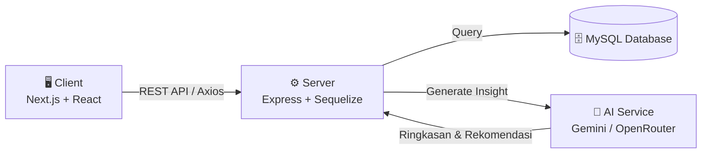

<div align="center">


<p>
  
  
  
</p>

<h3>💸 Aplikasi pencatatan keuangan pribadi dengan ringkasan &amp; rekomendasi otomatis dari AI</h3>

<p>
  <a href="#-fitur-utama">Fitur</a> •
  <a href="#-tech-stack">Tech Stack</a> •
  <a href="#-arsitektur">Arsitektur</a> •
  <a href="#-cara-menjalankan">Cara Menjalankan</a> •
  <a href="#-api-documentation">API Docs</a> •
  <a href="#-roadmap">Roadmap</a>
</p>

</div>

###

## 📖 Tentang Project

**AI Budget Tracker** adalah aplikasi web fullstack untuk mencatat pemasukan & pengeluaran harian, mengelompokkannya ke dalam kategori, dan mendapatkan **ringkasan serta rekomendasi keuangan otomatis** yang dihasilkan oleh AI setiap bulannya. Dibangun dengan arsitektur terpisah antara **Client** (Next.js) dan **Server** (Express REST API), project ini dirancang modular, aman, dan mudah dikembangkan lebih lanjut.

###

## ✨ Fitur Utama

<table>
<tr>
<td width="33%" valign="top">

### 🔐 Autentikasi
- Register & Login dengan JWT
- Password ter-hash dengan bcrypt
- Middleware proteksi route

</td>
<td width="33%" valign="top">

### 💰 Manajemen Transaksi
- CRUD transaksi pemasukan/pengeluaran
- Pengelompokan berdasarkan kategori
- Riwayat transaksi lengkap

</td>
<td width="33%" valign="top">

### 🤖 AI Insight
- Ringkasan keuangan bulanan otomatis
- Rekomendasi finansial dari AI
- Visualisasi data dengan chart

</td>
</tr>
</table>

###

## 🛠 Tech Stack

<div align="center">

**Frontend**


<br/><br/>

**Backend**


</div>

<div align="center">

| Layer | Stack |
|---|---|
| **Frontend** | Next.js 15 (App Router + Turbopack), React 19, TypeScript, TailwindCSS 4, Axios, Recharts, React Hot Toast |
| **Backend** | Node.js, Express 5, Sequelize ORM, MySQL |
| **Auth & Security** | JSON Web Token (JWT), bcrypt, Helmet, CORS, express-validator, Zod |
| **AI Engine** | Gemini API / OpenRouter — untuk generate ringkasan & rekomendasi bulanan |

</div>

###

## 🏗 Arsitektur



###

## 📂 Struktur Project

<details>
<summary><b>Klik untuk lihat struktur folder <code>Server/</code></b></summary>

```
Server/
├── src/
│   ├── config/            # Konfigurasi env, database, JWT
│   ├── errors/            # Custom error classes (NotFound, BadRequest, dll)
│   ├── middlewares/       # Auth, validasi, security, error handler
│   ├── modules/
│   │   ├── auth/          # Register, login, profile
│   │   ├── user/          # CRUD user
│   │   ├── category/      # CRUD kategori transaksi
│   │   ├── transaction/   # CRUD transaksi
│   │   └── monthlySummary/# Ringkasan & rekomendasi AI bulanan
│   ├── store/             # Koneksi Sequelize
│   ├── app.js             # Setup Express app & middleware
│   ├── routes.js          # Root router
│   └── server.js          # Entry point
├── models/                # Sequelize models (generated)
└── package.json
```

</details>

<details>
<summary><b>Klik untuk lihat struktur folder <code>Client/</code></b></summary>

```
Client/
├── src/
│   ├── app/
│   │   ├── dashboard/
│   │   │   ├── profile/
│   │   │   ├── summary/
│   │   │   └── transaction/
│   │   │       ├── create/
│   │   │       └── edit/[id]/
│   │   └── page.tsx        # Landing / Auth page
│   ├── api/                # Axios instance
│   ├── services/           # Auth, user, category, transaction, summary service
│   ├── interfaces/         # TypeScript types
│   ├── ui/                 # Reusable components (Sidebar, Modal, Card, dll)
│   ├── utils/              # Helper functions (format rupiah, error handler, dll)
│   └── pages/              # Auth & transaction form pages
└── package.json
```

</details>

###

## 🚀 Cara Menjalankan

### Prasyarat
- Node.js v18.18+
- MySQL Server (aktif di port 3306)
- npm

### 1️⃣ Clone Repository

```bash
git clone <repo-url>
```

### 2️⃣ Setup Backend

```bash
cd Server
npm install
copy .env.example .env      # sesuaikan kredensial database & secret
npm run dev
```

Server berjalan di `http://localhost:5001`

### 3️⃣ Setup Frontend

```bash
cd Client
npm install
copy .env.example .env.local
npm run dev
```

Client berjalan di `http://localhost:3000`

### 🔑 Environment Variables

<details>
<summary><b>Server (<code>.env</code>)</b></summary>

```env
DB_HOST=127.0.0.1
DB_PORT=3306
DB_USER=root
DB_PASSWORD=
DB_DATABASE=budget_tracker

JWT_SECRET=your_jwt_secret_here

SERVER_PORT=5001
SERVER_BASE_URL=http://localhost:5001

GEMINI_API_KEY=your_gemini_api_key
OPENROUTER_API_KEY=your_openrouter_api_key
```

</details>

<details>
<summary><b>Client (<code>.env.local</code>)</b></summary>

```env
NEXT_PUBLIC_API_DEV_BASE_URL_V1=http://localhost:5001/api/v1
NEXT_PUBLIC_API_PROD_BASE_URL_V1=https://your-production-api.com/api/v1
```

</details>

###

## 📡 API Documentation

<details>
<summary><b>🔐 Auth</b></summary>

| Method | Endpoint | Deskripsi |
|---|---|---|
| `POST` | `/api/v1/auth/register` | Registrasi user baru |
| `POST` | `/api/v1/auth/login` | Login, mengembalikan JWT token |
| `GET` | `/api/v1/auth/profile` | Ambil data profil user yang sedang login |

</details>

<details>
<summary><b>👤 Users</b></summary>

| Method | Endpoint | Deskripsi |
|---|---|---|
| `GET` | `/api/v1/users` | Ambil semua user |
| `POST` | `/api/v1/users` | Tambah user baru |
| `PUT` | `/api/v1/users/:id` | Update data user |
| `DELETE` | `/api/v1/users/:id` | Hapus user |

</details>

<details>
<summary><b>💳 Transactions</b></summary>

| Method | Endpoint | Deskripsi |
|---|---|---|
| `GET` | `/api/v1/transactions` | Ambil semua transaksi |
| `POST` | `/api/v1/transactions` | Tambah transaksi baru |
| `PUT` | `/api/v1/transactions/:id` | Update transaksi |
| `DELETE` | `/api/v1/transactions/:id` | Hapus transaksi |

</details>

<details>
<summary><b>📊 Monthly Summary (AI)</b></summary>

| Method | Endpoint | Deskripsi |
|---|---|---|
| `GET` | `/api/v1/monthly-summaries` | Ambil ringkasan bulanan |
| `POST` | `/api/v1/monthly-summaries` | Generate ringkasan & rekomendasi AI baru |

</details>

###

## 🗺 Roadmap

- [x] Autentikasi (register, login, JWT)
- [x] CRUD User
- [x] CRUD Transaksi
- [x] Ringkasan & rekomendasi AI bulanan
- [ ] CRUD Kategori (sedang dikembangkan)
- [ ] Export laporan ke PDF/Excel
- [ ] Notifikasi budget limit
- [ ] Dark mode

###

## 🤝 Kontribusi

Kontribusi, issue, dan feature request sangat diterima!

1. Fork project ini
2. Buat branch fitur (`git checkout -b fitur/nama-fitur`)
3. Commit perubahan (`git commit -m 'Tambah fitur x'`)
4. Push ke branch (`git push origin fitur/nama-fitur`)
5. Buka Pull Request

###

## 📄 License

Project ini menggunakan lisensi **MIT** — bebas digunakan, dimodifikasi, dan didistribusikan.

<div align="center">


Made with ❤️ and ☕ by **Fandi Ardyan**

</div>